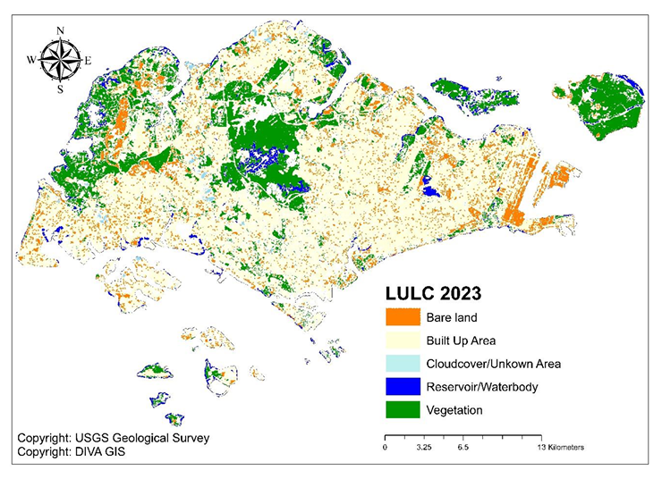

Project 1

Title: Monitoring Urban Expansion in Abuja, Nigeria Using Remote Sensing and GIS Techniques

Tools Used:

QGIS

Google Earth Engine (GEE)

Landsat satellite imagery (Landsat 5 TM, Landsat 8 OLI/TIRS)

Microsoft Excel

Supervised Classification (Maximum Likelihood Classifier)

Maps:

Project Description:
This project utilized remote sensing and GIS tools to analyze the spatial and temporal patterns of urban expansion in Abuja, Nigeria between 2000 and 2020. The study aimed to understand the growth dynamics and land use changes in the region by analyzing satellite imagery over two decades.

Key findings:

There was a significant increase in built-up areas from 2000 to 2020, with a corresponding reduction in vegetation and bare surfaces.

Urban area increased from 95.03 km² in 2000 to 498.06 km² in 2020.

The annual rate of urban expansion was calculated to be 20.15 km² per year.

The findings indicate rapid urban growth driven by population increase, economic activities, and infrastructural development.

Dashboard Overview:
Though not presented in a digital dashboard, the project includes several visual representations of land cover change and urban expansion using classified satellite imagery, charts, and tables. These include:

Land Use/Land Cover (LULC) maps for 2000, 2010, and 2020

Area statistics and change detection charts

Pie charts showing land cover composition by year

